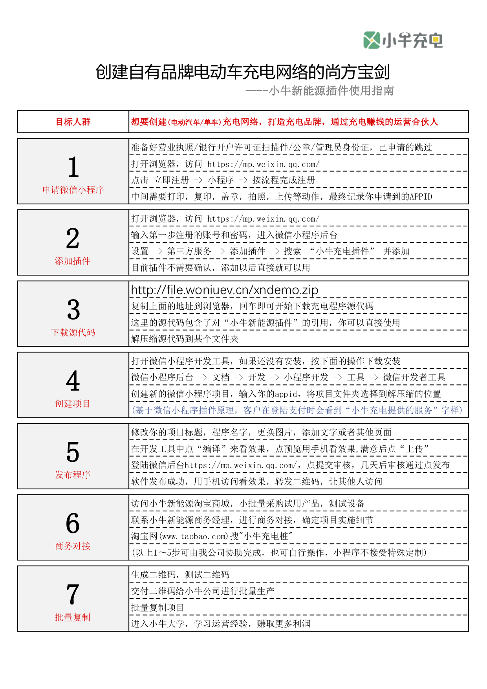
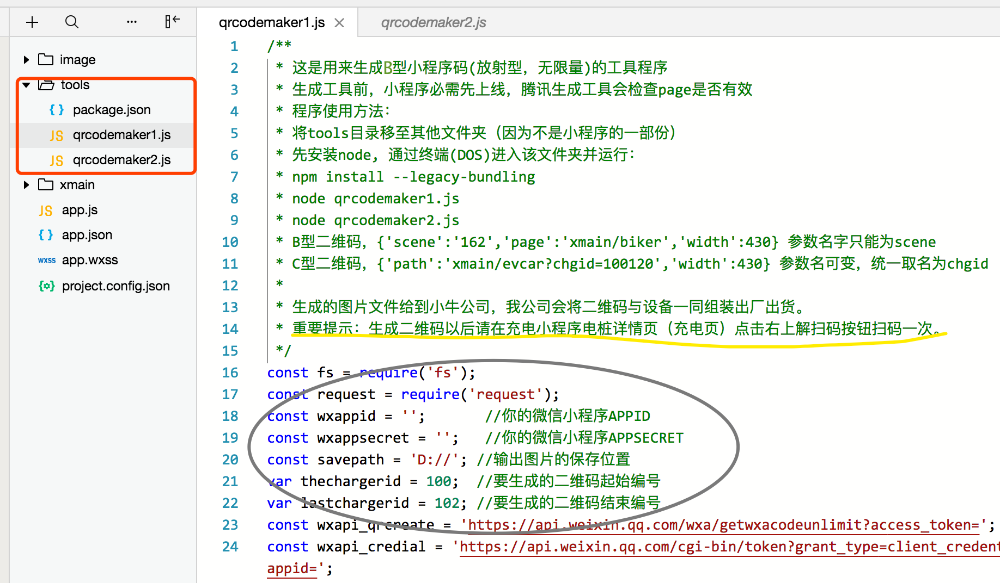
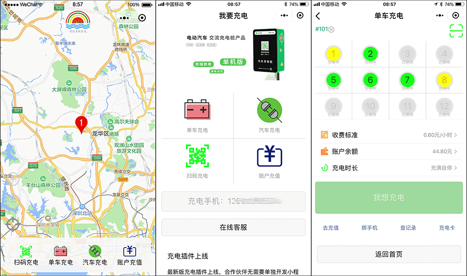
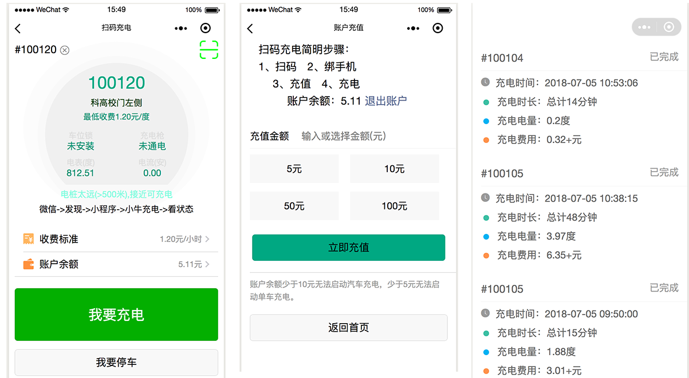
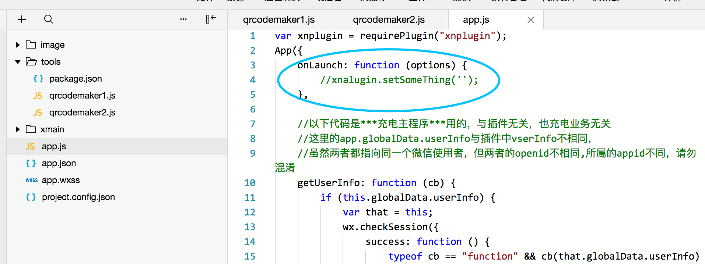
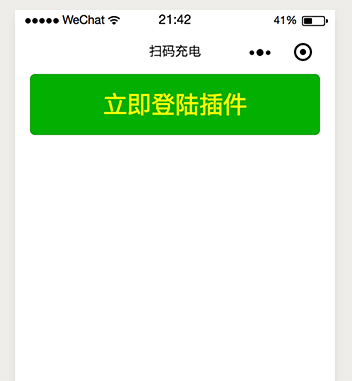

# 0. 小牛充电插件
用来开发电动汽车/电动单车充电微信小程序的插件。

开发者可以在自己的程序中直接调用插件功能以执行充电的所有操作，包括启动、计费、支付、监控等而无需要额外的软件开发。

本插件仅支持小牛新能源公司生产的硬件设备，包括汽车交流充电桩，汽车直流充电桩，一拖十二单车充电桩等产品。

&copy;深圳小牛新能源有限公司 2018

## 0.1 相关术语
***主微信小程序***：合作伙伴开发的具有自主品牌的微信小程序

**小牛新能源插件**：由小牛新能源公司开发的可以直接在主微信小程序中引用的插件

小牛新能源充电桩：由小牛新能源公司研发的硬件设备，包括汽车充电桩和单车充电桩

主程序APPID：合作伙伴向腾讯公司申请的***主微信小程序***APPID

充电插件APPID：由小牛公司向腾讯公司申请的插件APPID，即：wx5a3782a4284eacc4

## 0.2 有什么好处
1. 合作伙伴拥有完全自主的品牌标识
2. 合作伙伴拥有完全自主的客户服务
3. 合作伙伴拥有完全自主的客户数据
4. 完备的硬件产品线，电动自行车充电，电动汽车充电，小牛公司完全自主研发
5. 提供全面的技术支持和入门指导，快速开发，快速上线
6. 提供完整可用的插件调用源代码，具备完整的充电功能，可扩展性强，合作伙伴可自行添加任意功能
7. 完全免费的案例源代码，无需软件开发经验，10分钟创建自己的充电小程序
8. 零门槛，低风险，10分钟拥有自己的APP，20分钟拥有自己的品牌，30分钟创建自己的充电站

# 1. 最简上手步骤

## 1.1 从入门到精通
1. 准备好营业执照/银行开户许可证扫描件/管理员身份证，访问<https://mp.weixin.qq.com/>申请微信小程序，记下appid，已经申请的跳过
2. 在微信公众平台（微信小程序后台<https://mp.weixin.qq.com/>,设置->第三方服务->添加插件)添加“**小牛新能源插件**”
3. 下载源代码(1.2)解压缩
4. 运行开发工具，新建项目，输入appid，选择解压缩项目文件夹
5. 运行测试，真机预览，上传，提交审核，提交发布，上线
6. 进行商务对接，采购设备，测试设备
7. 生成二维码，交付工厂进行批量生产




## 1.2 下载源代码(复制到浏览器)：
http://file.woniuev.cn/xndemo.zip

http://file.woniuev.cn/xndemo_map.zip

想要最快速度拥有自己的充电APP，只需要使用上面的源代码就可以了。

下面的章节都是针对源代码的应用进行说明，有了源代码，任何说明都不需要。

微信小程序名字申请需要与公司名字相近。

## 1.3 创建二维码

在源代码的tools目录下有qrcodemaker1.js这个文件，按上图操作，就可以创建二维码了。

## 1.4 充电程序外观1


## 1.5 充电程序外观2



# 2. 插件开放接口

## 2.1 初始化插件
***主微信小程序***要调用插件接口，需要首先进行初始化：
```
    var xnplugin = requirePlugin("xnplugin");
```


## 2.2 插件登陆检查代码
用来检查充电用户是否已经登陆插件，
如果未登陆，可以引用2.3的按钮来登陆，也可以在**小牛新能源插件**页内点击登陆。
```
    var xnplugin = requirePlugin("xnplugin");
    var vserInfo = xnplugin.getVserInfo();
    if (vserInfo==false){
        console.log('用户没有登陆插件');
    }else{
        console.log('用户绑定的手机号', vserInfo.usermobile);
    }
```
退出插件登陆状态：
```
    xnplugin.setVserInfo(false);
```
xnplugin.getVserInfo() 返回值中有用字段列表：
vserInfo.usermobile: 客户的手机号，为空不能充电
vserInfo.openid:     客户的OPENID，不能为空
vserInfo.balance:    保留两位小数的账户余额
vserInfo.balanum:    数字型账户余额
vserInfo.pakingid:   正在停车使用的充电桩编号（汽车）
vserInfo.reghours:   到目前为止注册的小时数


## 2.3 插件登陆按钮
在***主微信小程序***中直接引用登陆按钮，不必在**小牛新能源插件**页登陆，更好的用户体验。
```
    <loginbtn
        customtype="primary"
        customtitle="立即登陆插件"
        customstyle="font-size:1.5em;color:green;" />
```
以上代码在一个空白页面中的实际效果：



## 2.4 软件开发建议
由于引入了插件页面跳转，而这是最新版才有的功能，所以微信程序必需为最新版本。
***主微信小程序***要注意检查和引导客户更新。

# 3. 汽车充电插件
```
    <evcar />
    <evcar optid="{{qrscandcode}}"/>
    <evcar optid="{{mycode}}"/>
```
以上三种语法都可以。
optid表示调用者***主微信小程序***中获取到的电桩编号，
可以是扫码得到的，也可以是其他方式得到的（比如输入，点连接等）

# 4. 单车充电插件
```
    <biker />
    <biker optid="{{qrscandcode}}"/>
    <biker optid="{{mycode}}"/>
```
以上三种语法都可以。
optid表示调用者***主微信小程序***中获取到的电桩编号，
可以是扫码得到的，也可以是其他方式得到的（比如输入，点连接等）

# 5 可选引用插件
这里列出的其他插件在非必要的情况下，不必引用，
因为在插件主入口（biker/evcar）中已经包含了对这些插件的引用和跳转。
***主微信小程序***只需要引用biker和evcar两个页面就可以了。

## 5.1 账户充值
```
   <recharge hasback="0" />
```
可对本客户账户进行充值。充值金额直接进入运营商支付通道，由运营商直接管理。
充值账户显示当前微信小程序的余额。当前账户余额只能在本运营商所属的电桩上消费。


## 5.2 充值历史
```
   <chistory hasback="0" />
```
详细记录了每一次充值的日期，金额，来源，并可针对最后一次充值退款。

## 5.3 单车充电历史
```
   <bhistory hasback="0" />
```
详细记录保存了每一次单车充电的日期，电桩/插口号，充电金额，时长及充电功率。

## 5.4 汽车充电历史
```
   <ahistory hasback="0" />
```
详细记录保存了每一次汽车充电的日期，电桩编号，充电电量，充电金额。

## 5.5 汽车待支付账单
```
   <mybill hasback="0" />
```
汽车充电默认是自动扣款，但是在有超时占位费的情况下需手动结算，这是支付页面。
电动单车充电是自动扣款，余额低于5元无法启动充电（自动充满）。
单车充电和汽车充电都有余额监测试机制，余额用光自动断电（可能会有少许负数）。

## 5.6 微信账户绑定
```
   <bindphone hasback="0" />
```
绑定和解绑手机的页面，客户必需要绑定手机才能充电。
解绑后不可充电。绑定手机要通过短信验证码验证。

# 6. 内置扫码功能
单车充电，汽车充电**小牛新能源插件**页面已经内置了扫码功能，内置扫码功能可以让客户在本页面不离开直接扫码。
本扫码功能支持接口B(小程序码,无限量）和接口C（二维码,有限量）类型的二维码，具体参考：
<https://developers.weixin.qq.com/miniprogram/dev/api/qrcode.html>
为了保持扫码统一，***主微信小程序***有如下建议：
单车充电页面取名为xmain/biker.wxml，
汽车充电取名为xmain/evcar.wxml
B型二维码参数：
{'scene':'10000','page':'xmain/biker','width':430}
{'scene':'10002','page':'xmain/evcar','width':430}
C型二维码参数：
{'path':'xmain/biker?chgid=190','width':430}
{'path':'xmain/evcar?chgid=100180','width':430}
重要：二维码生成后在APP的电桩详情页(充电页)对每一个码扫码一次。

# 7. 页面后期工作
无论哪一个插件，在引入到主程序中以后都可以额外添加元素，通常是在插件页面的最尾部增加按钮，连接，图片等。
如果添加到页面的组件不想追加到最尾部，可以通过（position:absolute）来实现任意位置定位。
合作商可以在自己的***主微信小程序***中添加更多的功能，以便于实现本地化服务或个性化应用。
最后开发合作商自己的功能页面，上线，交付使用。


# 8. 版权申明
***充电软件***源代码免费下载，免费使用，可自己随意修改，客户不拥有代码所有权，不可申明版权。
***充电软件***源代码免费提供，客户可以在此基础上自已修改，充电软件一经修改，与小牛新能源没有任何关系。
小牛公司向客户提供的交付件仅限于小牛新能源插件和本接口文档，
小牛公司有责任长期升级和维护小牛新能源插件，不接受客户定制。
小牛公司愿意协助客户将*小程序*改用客户自己名字，自己的LOGO，不接受除此之外的其他修改，
但客户可以自己增加/修改任何内容。增加/修改的部份为自有版权。
***小牛新能源微信小程序插件***版权归&copy;深圳小牛新能源有限公司所有，客户可以免费使用，客户不得抄袭，逆向工程等违法活动。
***小牛新能源硬件设备***版权归&copy;深圳小牛新能源有限公司所有，客户采购以后拥有产权，使用权，但不得抄袭，逆向工程等违法活动，一经发现，公司保留向违法者提起诉讼的权利。

# 9. 设备采购
小批量采购不接受任何形式定制，按原厂原价出货，拒绝议价。
大批量定制和合作请联系客户经理。

## 9.1 采购小牛新能源单车充电桩设备
(复制链接到浏览器)
https://item.taobao.com/item.htm?spm=a1z10.1-c.w4004-8421736029.2.46547307JNgzUk&id=565433890730

## 9.2 采购小牛新能源汽车充电桩设备
(复制链接到浏览器)
https://item.taobao.com/item.htm?spm=a1z10.1-c.w4004-8421736029.6.46547307JNgzUk&id=565156191735
