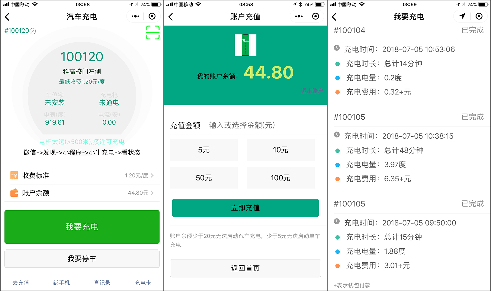

# 0. 小牛充电插件
用来开发电动汽车/电动单车充电微信小程序的插件，开发者可以在自己的程序中直接添加插件以执行充电的所有操作，包括启动、计费、监控等。
本插件仅支持小牛公司生产的硬件设备，包括汽车交流充电桩，汽车直流充电桩，一拖十二单车充电桩等产品。
&copy;深圳小牛新能源有限公司 2018

## 0.1 相关术语
***主微信小程序***：合作商开发的具有自主品牌的微信小程序
**小牛充电插件**：由小牛新能源公司开发的可以直接在主微信小程序中引用的插件
小牛充电桩：由小牛新能源公司研发的硬件设备，分为汽车充电桩和单车充电桩
主程序APPID：合作商向腾讯公司申请的***主微信小程序***APPID
充电插件APPID：由小牛公司向腾讯公司申请的插件APPID，即：wx5a3782a4284eacc4

## 0.2 有什么好处
1. 具备完全自主的品牌标识
2. 具备完全自主的客户服务
3. 具备完全自主的客户数据
4. 完备的硬件产品线，电动自行车充电，电动汽车充电，完全自主研发
5. 提供完整可用的插件调用源代码，快速开发，快速上线
6. 提供全方面的技术支持，马上拥有自己的充电运营品牌
7. 完全免费的案例源代码，无需要软件开发经验，10分钟创建自己的充电小程序
8. 零门槛，低风险，10分钟拥有自己的APP，20分钟拥有自己的品牌，30分钟创建自己的充电站

## 0.3 如何开始
1. 具备初步的微信小程序开发能力并申请了微信小程序
2. 接着，你得在你的***主微信小程序***后台添加“**小牛充电插件**”
3. 最后，你得在你的程序中使用“小牛充电插件”
4. 接入插件，仔细认真阅读本文档，求助小牛公司




# 1. 最简上手步骤

## 1.1 下载源代码：
直接下载本项目就能得到完整源代码。
想要最快速度拥有自己的充电APP，直接下载本项目即可。
下面的内容都是针对上面源代码的实现介绍，有了源代码，所有介绍都不需要。

## 1.2 如何创建二维码

在源代码的tools目录下有qrcodemaker1.js这个文件，按上图操作，就可以创建二维码了。


# 2. 插件开放接口

## 2.1 初始化插件
***主微信小程序***要调用插件接口，需要首先进行初始化：
```
    var xnplugin = requirePlugin("xnplugin");
```


## 2.2 插件登陆检查代码
用来检查充电用户是否已经登陆插件，
如果未登陆，可以引用5.3的按钮来登陆，也可以在**小牛充电插件**页内点击登陆。
```
    var xnplugin = requirePlugin("xnplugin");
    var vserInfo = xnplugin.getVserInfo();
    if (vserInfo==false){
        console.log('用户没有登陆插件');
    }else{
        console.log('用户绑定的手机号', vserInfo.usermobile);
    }
```

## 2.3 插件登陆按钮
在***主微信小程序***中直接引用登陆按钮，不必在**小牛充电插件**页登陆，更好的用户体验。
```
    <loginbtn
        customtype="primary"
        customtitle="立即登陆插件"
        customstyle="font-size:1.5em;color:green;" />
```
以上代码在一个空白页面中的实际效果：


## 2.4 关于网络数据刷新
biker页面和evcar**小牛充电插件**页面有自动刷新机制，程序会反复向服务器后台请求网络数据，以便及时更新数据内容。
但是由于网络请求非常消耗资源，需要调用程序对网络请求进行控制，
因此在合作商开发的***主微信小程序***的单车/汽车充电页面需实现以下代码：
```
  onShow: function () {
      xnplugin.makeLoading(true);
  },
  onHide: function () {
      xnplugin.makeLoading(false);
  },
  onUnload: function () {
      xnplugin.makeLoading(false);
  },
```

## 2.5 软件开发建议
一定要记得同时在onHide和onUnload中调用makeLoading(false)
有些情况下，调用了插件接口的函数以后，要记得调用一下wx.reLaunch()以便刷新页面。
由于引入了插件页面跳转，而这是最新版才有的功能，所以微信程序必需为最新版本。
***主微信小程序***要注意检查和引导客户更新。

# 3. 汽车充电插件
```    <evcar />```
```    <evcar optid="{{qrscandcode}}"/>```
```    <evcar optid="{{mycode}}"/>```
以上三种语法都可以。
optid表示调用者***主微信小程序***中获取到的电桩编号，
可以是扫码得到的，也可以是其他方式得到的（比如输入，点连接等）

# 4. 电动车充电插件
```    <biker />```
```    <biker optid="{{qrscandcode}}"/>```
```    <biker optid="{{mycode}}"/>```
以上三种语法都可以。
optid表示调用者***主微信小程序***中获取到的电桩编号，
可以是扫码得到的，也可以是其他方式得到的（比如输入，点连接等）

# 5 其他插件
这里例出的其他插件在非必要的情况下，不必引用，
因为在插件主入口（biker/evcar）中已经包含了对这些插件的引用和跳转。
***主微信小程序***只需要引用biker和evcar两个页面就可以了。

## 5.1 账户充值
```   <recharge hasback="0" />```
可对本客户账户进行充值。充值的金额只能在本运营商所属的充电桩上充电。
比如：运营商具备某地市的经营权，则客户只能在该运营商安装在本地市的电桩上充电。

## 5.2 充值历史
```   <chistory hasback="0" />```
详细记录了每一次充值的日期，金额，来源，并可针对最后一次充值退款。

## 5.3 单车充电历史
```   <bhistory hasback="0" />```
详细记录保存了每一次单车充电的日期，电桩/插口号，充电金额，时长及充电功率。

## 5.4 汽车充电历史
```   <ahistory hasback="0" />```
详细记录保存了每一次汽车充电的日期，电桩编号号，充电电量，充电金额。

## 5.5 微信账户绑定
```   <bindphone hasback="0" />```
绑定和解绑手机的页面，客户必需要绑定手机才能充电。
解绑后不可充电。绑定手机要通过短信验证码验证。

# 6. 内置扫码功能
单车充电，汽车充电**小牛充电插件**页面已经内置了扫码功能，内置扫码功能可以让客户在本页面不离开直接扫码。
本扫码功能支持接口B(小程序码,无限量）和接口C（二维码,有限量）类型的二维码，具体参考：
<https://developers.weixin.qq.com/miniprogram/dev/api/qrcode.html>
为了保持扫码统一，***主微信小程序***单车充电页面取名为biker.wxml，汽车充电取名为evcar.wxml
C型二维码参数：
{'scene':'10000','page':'xmain/biker','width':430}
{'scene':'10002','page':'xmain/evcar','width':430}
B型二维码参数：
{'path':'xmain/biker?chgid=190','width':430}
{'path':'xmain/evcar?chgid=100180','width':430}

# 7. 页面美化和后期工作
无论哪一个插件，在引入到主程序中以后都可以额外添加元素，通常是在插件的最尾部增加按钮，连接，图片等。
如果添加到页面的组件不想追加到最尾部，可以通过（position:absolute）来实现任意位置定位。
合作商可以在自己的***主微信小程序***中添加更多的功能，以便于实现本地化服务或者个性化应用。
最后开发合作商自己的功能页面，上线，交付使用。


# 8. 采购设备
## 8.1 采购小牛电动单车充电桩设备
https://item.taobao.com/item.htm?spm=a1z10.1-c.w4004-8421736029.2.46547307JNgzUk&id=565433890730

## 8.2 采购小牛电动汽车充电桩设备
https://item.taobao.com/item.htm?spm=a1z10.1-c.w4004-8421736029.6.46547307JNgzUk&id=565156191735
